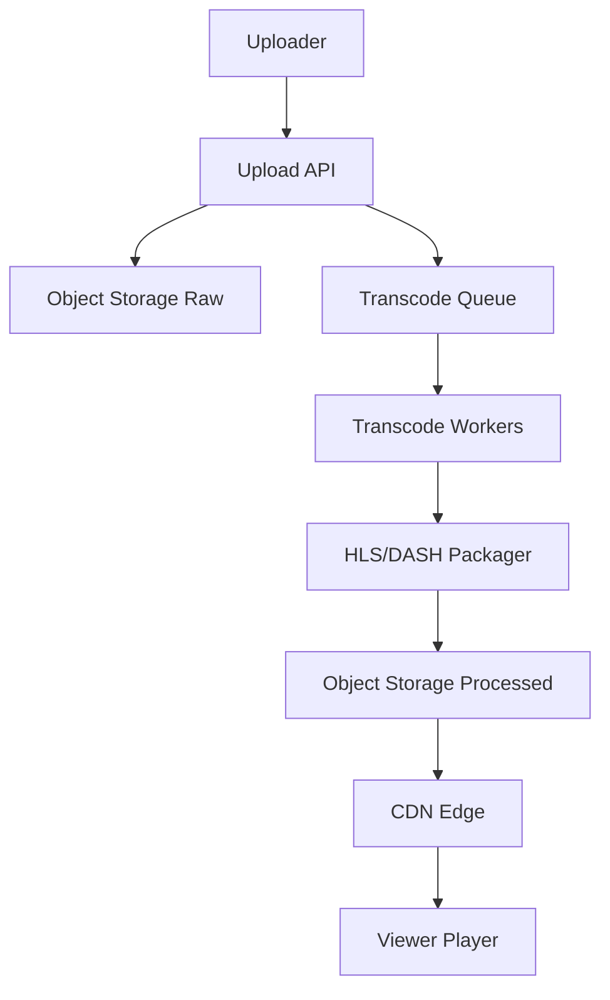
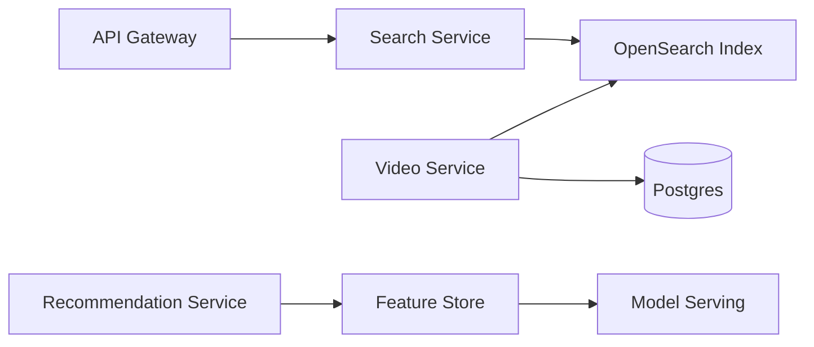
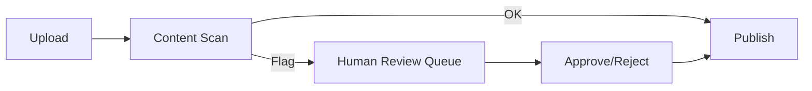
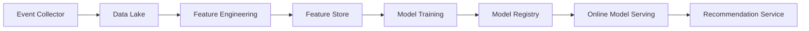
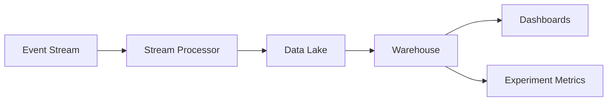
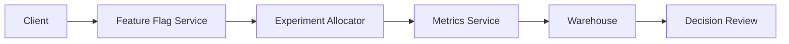

## YouTube-Scale Product Design (5 Iterations)

This document defines an end-to-end YouTube-style product across five iterations.
It includes UI/UX, gestures, architecture, APIs, data, infra, and safety systems.

---

### Iteration 1: MVP Core (End-to-End)

**Goal**
- Watch, search, upload, basic auth, comments, subscriptions, basic recommendations
- HLS streaming, basic analytics, basic moderation

**Core journeys**
- Guest: Home feed -> Search -> Watch -> Related videos
- Creator: Login -> Upload -> Processing -> Publish -> Watch
- Viewer: Subscribe -> Notifications -> Watch later

**Screens (web + mobile)**
- Home feed, Search results, Watch page, Channel page, Upload, Login/Signup

**Key gestures**
- Home: vertical scroll; long-press to quick actions (Save/Share/Not interested)
- Watch: double-tap left/right seek; pinch to zoom; swipe down to mini-player
- Search: swipe down to dismiss keyboard

**Architecture (single region)**
- Edge: CDN + WAF
- LB: Global HTTPS load balancer
- Services: API gateway, auth, video, channels, comments, search, recommendations, analytics
- Storage: object storage for raw video + processed HLS + thumbnails
- Queue: Redis/BullMQ or Kafka for transcode jobs
- DBs: Postgres (primary), Redis cache, OpenSearch

**Data model (high-level)**
- User, Channel, Video, Comment, Like, Subscription, WatchHistory, Playlist, Notification, AnalyticsEvent

**APIs (MVP)**
- Auth: `POST /auth/register`, `POST /auth/login`, `POST /auth/refresh`
- Videos: `GET /videos/feed`, `GET /videos/:id`, `POST /videos/upload`, `POST /videos/:id/view`
- Channels: `GET /channels/:handle`, `GET /channels/:id/videos`, `POST /channels/:id/subscribe`
- Comments: `GET /videos/:id/comments`, `POST /videos/:id/comments`
- Search: `GET /search?q=...`

---

### Iteration 2: Scale + Playback Quality

**Goal**
- Reliable streaming, ABR quality, scalable processing, better UX polish

**Playback**
- HLS/DASH multi-bitrate
- QoE telemetry: startup time, rebuffer, bitrate switches

**Infra**
- Multi-region read replicas
- Media origin + CDN regional edge caching
- Object storage tiering (hot/cold)
- Autoscaling transcode workers

**UX**
- Mini-player (PiP), Watch later, Save to playlist
- Related videos + queue

**Gestures**
- Swipe up/down for mini-player
- Double-tap to like (shorts)

---

### Iteration 3: Full Product Parity

**Goal**
- Creator studio, subscriptions feed, shorts, advanced discovery

**Creator Studio**
- Upload manager, thumbnail editor, captions, visibility controls
- Analytics dashboard (views, watch time, retention)

**Discovery**
- Subscriptions feed
- Trending, categories, tags
- Shorts vertical feed

**Recommendations**
- Hybrid model (collaborative + content-based)
- Feature store + online inference

**APIs**
- `GET /feed/subscriptions`
- `GET /videos/trending`
- `GET /shorts/feed`
- `POST /videos/:id/like`, `POST /videos/:id/dislike`

**Gestures**
- Shorts: swipe up/down to next/prev
- Watch: swipe left/right for previous/next in queue

---

### Iteration 4: Trust, Safety, Compliance

**Goal**
- Abuse prevention, moderation workflows, compliance

**Safety systems**
- Copyright matching (Content ID style)
- Spam detection (comments, bots)
- Age-gate and restricted content

**Moderation**
- Review queue with admin tools
- Appeals workflow

**APIs**
- `POST /reports`
- `POST /appeals`
- `GET /admin/moderation/queue`

**Gestures**
- Long-press for quick report on mobile

---

### Iteration 5: Global YouTube-Scale

**Goal**
- Active-active global, ML personalization, live + monetization

**Global infra**
- Multi-region active-active
- Global database with sharding
- Multi-CDN routing

**Advanced product**
- Live streaming + chat
- Premieres
- Memberships / Super Chat
- Multi-language audio tracks

**Gestures**
- Live: tap reactions; hold to send Super Chat

---

## UI/UX Specs (Key Screens)

### Home Feed
- Cards: thumbnail, duration, title, channel avatar/name/verified, views/time, menu
- States: loading skeleton, empty state, offline state
- Actions: tap to watch, hover preview (web), long-press menu (mobile)

### Watch Page
- Player: HLS/DASH, quality, captions, speed, theater/fullscreen, PiP
- Below player: title, views/time, like/dislike, share, save, subscribe, channel row
- Right rail: related videos with infinite scroll

### Search
- Suggestions, recent queries, voice search (mobile)
- Filters: upload date, type, duration, features, sort

### Channel Page
- Header: banner, avatar, verified badge, sub count, subscribe button
- Tabs: Home, Videos, Shorts, Playlists, Community, About

### Shorts
- Full-screen vertical player, stacked actions (like/comment/share)
- Swipe up/down for navigation

### Upload
- Steps: select file -> metadata -> visibility -> publish
- Progress: upload percent + processing status
- Errors: unsupported format, size, copyright match

### Comments
- Threaded replies, sort by Top/New
- Actions: like, reply, report, delete own

---

## Detailed UI Component Specs (States + Copy)

### Global Top Bar (Web)
- Elements: Logo, Search input, Upload, Notifications, Profile
- States: default, search-focused, authenticated, guest
- Copy:
	- Search placeholder: "Search"
	- Guest button: "Sign in"

### Bottom Nav (Mobile)
- Items: Home, Shorts, Create, Subscriptions, You
- States: active highlight, unread badge
- Copy:
	- Create sheet: "Create" -> "Upload video" / "Go live" / "Create short"

### Video Card (Standard)
- Elements: thumbnail, duration, title, channel name, views, time
- States: hover preview (web), loading skeleton, unavailable (private/deleted)
- Copy:
	- Unavailable: "This video is unavailable"

### Watch Player Controls
- Buttons: Play/Pause, Next, Volume, Captions, Settings, Theater, Fullscreen
- States: playing, paused, buffering, error
- Copy:
	- Error: "Playback error. Tap to retry."
	- Buffering: "Loading..."

### Like/Dislike Module
- Elements: Like, Dislike, Share, Save
- States: liked, disliked, disabled (guest)
- Copy:
	- Guest tooltip: "Sign in to like videos"

### Subscribe Module
- States: unsubscribed, subscribed, notifications on/off
- Copy:
	- Unsubscribed: "Subscribe"
	- Subscribed: "Subscribed"
	- Notifications: "All" / "Personalized" / "None"

### Comments Composer
- States: empty, typing, submitting, error
- Copy:
	- Placeholder: "Add a comment..."
	- Error: "Could not post comment. Try again."

### Search Filters
- Sections: Upload date, Type, Duration, Features, Sort
- States: applied filters chip bar
- Copy:
	- Empty results: "No results found for \"{query}\""

### Shorts UI
- Elements: full-screen video, right rail actions, bottom channel row
- States: paused, liked, muted
- Gestures: swipe up/down next/prev, double-tap like

### Upload Flow
- Step 1 (Select): "Drag and drop video files to upload"
- Step 2 (Details): title, description, thumbnail, audience
- Step 3 (Visibility): Private / Unlisted / Public
- States: uploading, processing, failed
- Copy:
	- Processing: "Processing video..."
	- Failed: "Upload failed. Try again."

---

## API Contracts (Representative)

### Auth
- `POST /auth/register` -> { user, accessToken, refreshToken }
- `POST /auth/login` -> { user, accessToken, refreshToken }
- `POST /auth/refresh` -> { accessToken, refreshToken }

### Videos
- `GET /videos/feed`
- `GET /videos/:id`
- `POST /videos/upload` (multipart)
- `POST /videos/:id/view`
- `POST /videos/:id/like` | `POST /videos/:id/dislike`
- `GET /videos/:id/like-status`

### Channels
- `GET /channels/:handle`
- `GET /channels/:id/videos`
- `POST /channels/:id/subscribe`
- `DELETE /channels/:id/subscribe`
- `PATCH /channels/:id/notifications`

### Comments
- `GET /videos/:id/comments?sort=top|new`
- `POST /videos/:id/comments`
- `POST /comments/:id/like`
- `DELETE /comments/:id`

### Search + Recommendations
- `GET /search?q=...&filters=...`
- `GET /recommendations/home`
- `GET /recommendations/related?videoId=...`

---

## Event Schemas (Representative)

- `VIDEO_VIEW` { userId?, videoId, watchTime, device, sessionId, ts }
- `VIDEO_LIKE` { userId, videoId, type, ts }
- `SEARCH` { userId?, query, resultsCount, ts }
- `VIDEO_QUALITY_CHANGE` { videoId, from, to, ts }

---

## Diagrams

### Playback + Transcode Flow

### Search + Discovery

### Moderation Pipeline

### ML Pipeline (Recommendations)

### Analytics Data Lake + BI

### A/B Testing and Experimentation

---

## Pixel-Level Layout Grids

### Web (Desktop)
- Grid: 12 columns
- Container: 1280px max, 24px gutters, 24px margins
- Header height: 64px
- Sidebar width: 240px expanded, 72px collapsed
- Watch layout: main 840px, right rail 360px, 24px gap

### Web (Tablet)
- Grid: 8 columns
- Container: 960px max, 20px gutters, 20px margins
- Sidebar collapses to icon-only

### Mobile
- Grid: 4 columns
- Margins: 16px
- Bottom nav height: 56px
- Player: full width, 16:9

### Spacing + Type Scale
- Base spacing: 4px scale (4, 8, 12, 16, 24, 32)
- Type scale: 12, 14, 16, 20, 24, 32
